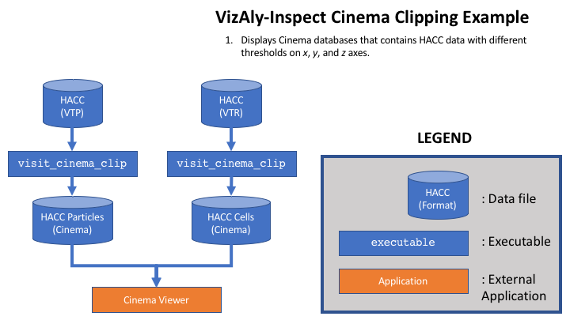

# VizAly-Inspect: A package for inspecting HACC and Nyx datasets

This repository contains tools for comparing HACC and/or Nyx datasets.

## Dependencies

To execute the full breath of this toolkit, the following dependencies should be met:
  * GenericIO
  * VisIt
  * Python 3 packages from ``requirements.txt``

An example script ``tools/install.sh`` shows how these dependencies (except VisIt) could be installed into a virtual environment.

## Copyright and license
This software is open source software available under the BSD-3 license.

Copyright (c) 2017, Triad National Security, LLC. All rights reserved.

This program was produced under U.S. Government contract 89233218CNA000001 for Los Alamos National Laboratory (LANL), which is operated by Triad National Security, LLC for the U.S. Department of Energy/National Nuclear Security Administration. The U.S. Government has rights to use, reproduce, and distribute this software. NEITHER THE GOVERNMENT NOR LOS ALAMOS NATIONAL SECURITY, LLC MAKES ANY WARRANTY, EXPRESS OR IMPLIED, OR ASSUMES ANY LIABILITY FOR THE USE OF THIS SOFTWARE. If software is modified to produce derivative works, such modified software should be clearly marked, so as not to confuse it with the version available from LANL.

All rights in the program are reserved by Triad National Security, LLC, and the U.S. Department of Energy/National Nuclear Security Administration. The Government is granted for itself and others acting on its behalf a nonexclusive, paid-up, irrevocable worldwide license in this material to reproduce, prepare derivative works, distribute copies to the public, perform publicly and display publicly, and to permit others to do so.

# Example: Convert HACC GenericIO data to VTK formats

There exists some excutables to convert HACC GenericIO files into VTK particle or rectilinear grid format after resampling.
This allows HACC datasets to be loaded into downstream visualization toolkits such as VisIt or ParaView.
An example workflow is depicited in the image and commands below.


```
INPUT_FILE="m000.full.mpicosmo.100"
python bin/tvtk_convert_hacc \
    --input-file ${INPUT_FILE} \
    --output-file hacc_test.vtp \
    --scalars vx vy vz hh mass
VisIt -nowin -cli -s bin/visit_sph_resample \
    --input-file hacc_test.vtp \
    --output-file-prefix hacc_vz \
    --scalar vz \
    --tensor-support hh \
    --mass mass \
    --grid-min 0 0 0 \
    --grid-max 20 20 20 \
    --resample-grid 20 20 20
```

# Example: Cinema database with clipping planes

There exists an executable ``bin/visit_cinema_clipper`` which generates a Cinema database.
Thresholds on the ``x``, ``y``, and ``z`` planes are applied to view inside the simulation.
The output Cinema database could be explored with a Cinema HTML viewer (https://github.com/cinemascience/cinema_simpleviewers).
An example workflow is depicited in the image and commands below.

```
# HACC paticle data
VisIt -nowin -cli -s bin/visit_cinema_clip \
    --input-file hacc_test.vtp \
    --output-file hacc_vz_particles.cdb \
    --scalar vz \
    --grid-min 0 0 0 \
    --grid-max 20 20 20 \
    --grid-steps 20 20 20 \
    --particles
# HACC cell data
VisIt -nowin -cli -s bin/visit_cinema_clip \
    --input-file hacc_vz.vtk \
    --output-file hacc_vz_resampled.cdb \
    --scalar vz \
    --grid-min 0 0 0 \
    --grid-max 20 20 20 \
    --grid-steps 20 20 20
# Cinema viewer
git clone https://github.com/cinemascience/cinema_simpleviewers.git
mv hacc_vz_particles.cdb hacc_vz_resampled.cdb cinema_simpleviewers/spec_d/data
```
Note you will need to edit the ``dataSets`` variable in ``cinema_simpleviewers/spec_d/index.html`` to include your datasets.
Once you have done this, then point your browser to ``cinema_simpleviewers/spec_d/index.html``.
