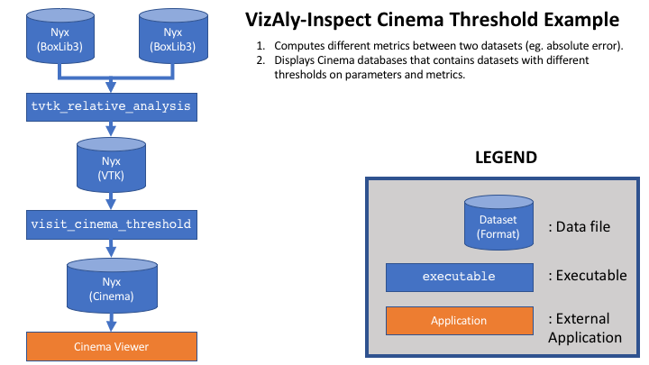

# VizAly-Inspect: A package for inspecting HACC and Nyx datasets

This repository contains tools for comparing HACC and/or Nyx datasets.

## Dependencies

To execute the full breath of this toolkit, the following dependencies should be met:
  * GenericIO
  * VisIt
  * Python 3 packages from ``requirements.txt``

An example script ``tools/install.sh`` shows how these dependencies (except VisIt) could be installed into a virtual environment.

## Copyright and license
LANS has asserted copyright on the software package C17078, entitled Framework for Analysis and Visualization of Simulation Data.

# Example: Convert HACC GenericIO data to VTK formats

There exists some excutables to convert HACC GenericIO files into VTK particle or rectilinear grid format after resampling.
This allows HACC datasets to be loaded into downstream visualization toolkits such as VisIt or ParaView.
An example workflow is depicited in the image and commands below.


```
INPUT_FILE="m000.full.mpicosmo.100"
python bin/tvtk_convert_hacc \
    --input-file ${INPUT_FILE} \
    --output-file hacc_test.vtp \
    --scalars vx vy vz hh mass
VisIt -nowin -cli -s bin/visit_sph_resample \
    --input-file hacc_test.vtp \
    --output-file-prefix hacc_vz \
    --scalar vz \
    --tensor-support hh \
    --mass mass \
    --grid-min 0 0 0 \
    --grid-max 20 20 20 \
    --resample-grid 20 20 20
```

# Example: Cinema database with clipping planes

There exists an executable ``bin/visit_cinema_clipper`` which generates a Cinema database.
Thresholds on the ``x``, ``y``, and ``z`` planes are applied to view inside the simulation.
The output Cinema database could be explored with a Cinema HTML viewer (https://github.com/cinemascience/cinema_simpleviewers).
An example workflow is depicited in the image and commands below.

```
# HACC paticle data
VisIt -nowin -cli -s bin/visit_cinema_clip \
    --input-file hacc_test.vtp \
    --output-file hacc_vz_particles.cdb \
    --scalar vz \
    --grid-min 0 0 0 \
    --grid-max 20 20 20 \
    --grid-steps 20 20 20 \
    --particles
# HACC cell data
VisIt -nowin -cli -s bin/visit_cinema_clip \
    --input-file hacc_vz.vtk \
    --output-file hacc_vz_resampled.cdb \
    --scalar vz \
    --grid-min 0 0 0 \
    --grid-max 20 20 20 \
    --grid-steps 20 20 20
# Cinema viewer
git clone https://github.com/cinemascience/cinema_simpleviewers.git
mv hacc_vz_particles.cdb hacc_vz_resampled.cdb cinema_simpleviewers/spec_d/data
```
Note you will need to edit the ``dataSets`` variable in ``cinema_simpleviewers/spec_d/index.html`` to include your datasets.
Once you have done this, then point your browser to ``cinema_simpleviewers/spec_d/index.html``.

# Example: Cinema database with thresholds

There exists an executable ``bin/visit_cinema_threshold`` which generates a Cinema database.
It thresholds on any variables in the file.
Another executable ``bin/tvtk_relative_analysis`` can be used to compute metrics between two datasets (eg. relative error).
An example workflow is depicted in the image and commands below.

```
# compute metrics
python bin/tvtk_relative_analysis \
    --input-file-1 ${INPUT_FILE_1} \
    --input-file-2 ${INPUT_FILE_2} \
    --output-file metrics_${PARAM}.vtk \
    --scalar ${PARAM} \
    --operation abs_diff_mag rel_diff_mag_pct scalar_1 scalar_2 debug
# threshold
VisIt -nowin -cli -s bin/visit_cinema_threshold \
    --input-file metrics_${PARAM}.vtk \
    --output-file metrics_${PARAM}.cdb \
    --scalar ${PARAM} \
    --metrics ${PARAM}:0,500,1000,5000,10000,25000,50000,100000 \
              abs_diff_mag:0,500,1000,5000 \
              rel_diff_mag_pct:0,1,2,5,10,25,50,100,200 \
     --colorbar-min 1.0 \
     --log
# Cinema viewer
git clone https://github.com/cinemascience/cinema_simpleviewers.git
mv hacc_vz_particles.cdb hacc_vz_resampled.cdb cinema_simpleviewers/spec_d/data
```
Note you will need to edit the ``dataSets`` variable in ``cinema_simpleviewers/spec_d/index.html`` to include your datasets.
Once you have done this, then point your browser to ``cinema_simpleviewers/spec_d/index.html``.
